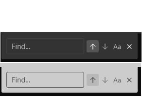
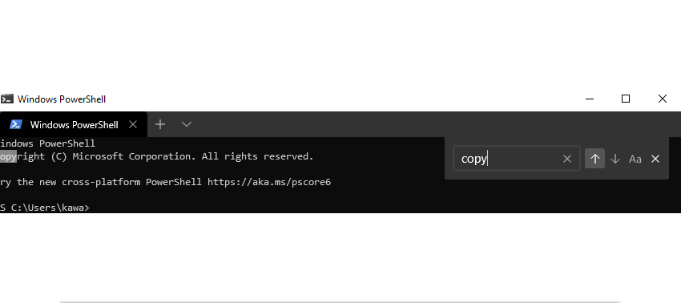

# Search in Terminal

## Abstract

This spec is for feature request #605 "Search". It goes over the details of a new feature that allows users to search text in Terminal, within one tab or from all tabs. Expected behavior and design of this feature is included. Besides, future possible follow-up works are also addressed. 

## Inspiration

One of the superior features of iTerm2 is it's content search. The search comes in two variants: search from active tab and search from all tabs. In almost any editor, there is an roughly equivalent string search. We also want to realize search experience in Terminal. There will be two variants, search within one tab or from multiple tabs. We will start with one-tab search implementation. 

## Solution Design

Our ultimate goal is to provide both search within one tab and search from all tabs experiences. But we can start with one-tab search. The search experience should have following features:

1. The search is triggered by KeyBindings. A new setting property named "openFind" will be enabled in the Json file. The user can set their own key bindings for search. The default is "ctrl + F". 
2. The user search in a XAML TextBox, which is contained in a custom SearchBoxControl. The default position of the search box is the top right corner, the user can also move it to bottom right corner to avoid blocking text. 
3. We can have multiple search methods. The simplest one is exact text match. Other match methods include case-sensitive exact match and regex match. In the first phrase, we will focus on case sensitive/insensitive text exact match. 
4. If currently there is no active selection, the search starts from the last line of the mutableViewport. If there is an active selection, we start from the previous or the next text of the selected text. We automatically go around if we reach the start point of the search. 
5. The search dialog should not block terminal's view. In phrase one, this is achieved by make search box movable. The user can move the search box to the bottom right corner.
6. The user should be able to fully interact with the terminal when the search box is on screen. 
7. For accessibility concerns, the user should be able to navigate all the iteractive elements on the search box using keyboard tab if the search box is focused. Searchbox could be created and closed with keyboard bindings. Close is usually binding to Esc. 
8. To avoid searchBox from blocking the terminal window, the search box could be moved to the bottom right by clicking a button. 

Conhost already has a module for search. It realizes case sensitive or insensitive exact text match search, and it provides methods to select the found word. However, we want to make search as a shared component between Terminal and Console host. Now search module is part of Conhost, and its dependencies include BufferOut and some other types in ConHost such as SCREEN_INFORMATION. In order to make Search a shared component, we need to remove its dependency on ConHost types. BufferOut is already a shared component, but we need to make sure there is no other Conhost dependency.

We will create a SearchBoxControl Xaml UserControl element. When a search process begins, a SearchBoxControl object will be created and attach to TermControl root grid. In other words, one SearchBox is added for each TermControl. The reasons for this design is:

1. Each TermControl object is a Terminal Window and has a individual text buffer. In phrase 1 we are going to search witin the current terminal text buffer. 
2. If we put the search box under TerminalApp, then the search can only happen on the current focused Terminal. 
3. If the community does not like the current design, we can lift SearchBox to a higher level. 

### Search process
1. The user press Ctrl+F (or user's custom key binding) to open the search box. Focus will move to the TextBox. 
2. Search is performed on a XAML TextBox. Once the user presses Enter or click up/down arrow button, we start to search from the last line of the current viewport or the current selection, and try to find the exact text in the text buffer. The nearest searched one will be selected. Then the search start point will be set to the selected text. The next search will start before or after the previous searched text.
3. The user can choose to search up or down by choosing up arrow or down arrow buttons. The chosen button will be styled to indicate it is selected. If the user does not click the arrows buttons, the default direction is up. 
4. The user can choose to do case sensitive or insensitive match by checking a check box. The default is case insensitive. 
5. If the search box is focused, the user can navigte all the elements on the search box using tab. When selected, press Enter equals to click. 
6. If the user click the "X" button or press <kbd>Esc</kbd>, the search stopped and the search box disappears and focus will move back to Terminal. In phrase one we do not store any state. 
7. Once the search box is closed (exiting search mode), the selection will still be there. This coincides with the current VS Code and cmd experience. To get rid of the selection, the user can just click other area of the window.

## UI/UX Design

Above is the SearchBoxControl. The two buttons with up/down arrows controls the search direction, it will be styled once clicked. The checkbox, if checked, means that we are searching case-sensitivily. The Dockbottom button on the right of the checkbox is for moving the search box to top/bottom. 

The search box defaults to be on the top right corner of the Terminal window. If the current tab is split into panes, each pane will have a individual searchbox. The user can move it to bottom to avoid it blocking too much screen contents. 

## Capabilities

1. The user can search exact matched text in the text buffer of the Terminal Screen. 
2. The user can choose to search case sensitively and insensitively. 
3. The user can search up or down. 
4. Found text will be selected. 
5. The search will start from the active selected text (inclusive) if there is one, or where the cursor is. 
5. The search will automatically go around when it reaches the starting point.
7. The search box can be positioned at either the top left or the bottom left of the terminal. 
8. The user can use Tab to navigate all the elements in the search box. 

### Accessibility

The user should be able to use search by keyboard only.
Once the searchbox is focused, the user can navigate between elements in the search box using Tab. And "click" using Enter. 

### Security

This feature should not introduce any new security issues.

### Reliability

1. The key input of Terminal command line and the search box should be separated. search box should not block interaction with the command line when it is open. 
2. The search box should not block text. This issue could be addressed by make search box movable. 

### Compatibility

This feature won't break existing features of Terminal.

### Performance, Power, and Efficiency

This feature only launches in need. It does not impact the performance of Terminal. 

## Potential Issues

1. The search bar should not block command line view. 
2. Search should not block any program the Terminal is currently executing.

## Future considerations

In version 1, we want realize a case sensitive/insensitive exact text match. But we may consider the following features in version 2:

1. Add "Find" button in dropdown menu to trigger search. 
2. Search from all tabs. For Version 1 we just want to realize search within one tab. However, the community also requests search from all tabs. We put in our goals for Version 2. 
3. Regular experssion match. 
4. Search history.
5. High-light while you type. Emphasizing all the other matches in the buffer with an outline or selection with another color. 
 

## Resources

Github Issue: https://github.com/microsoft/terminal/issues/605
